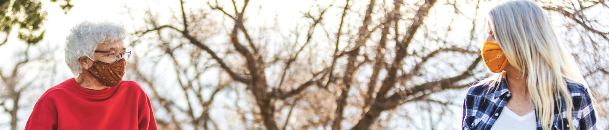
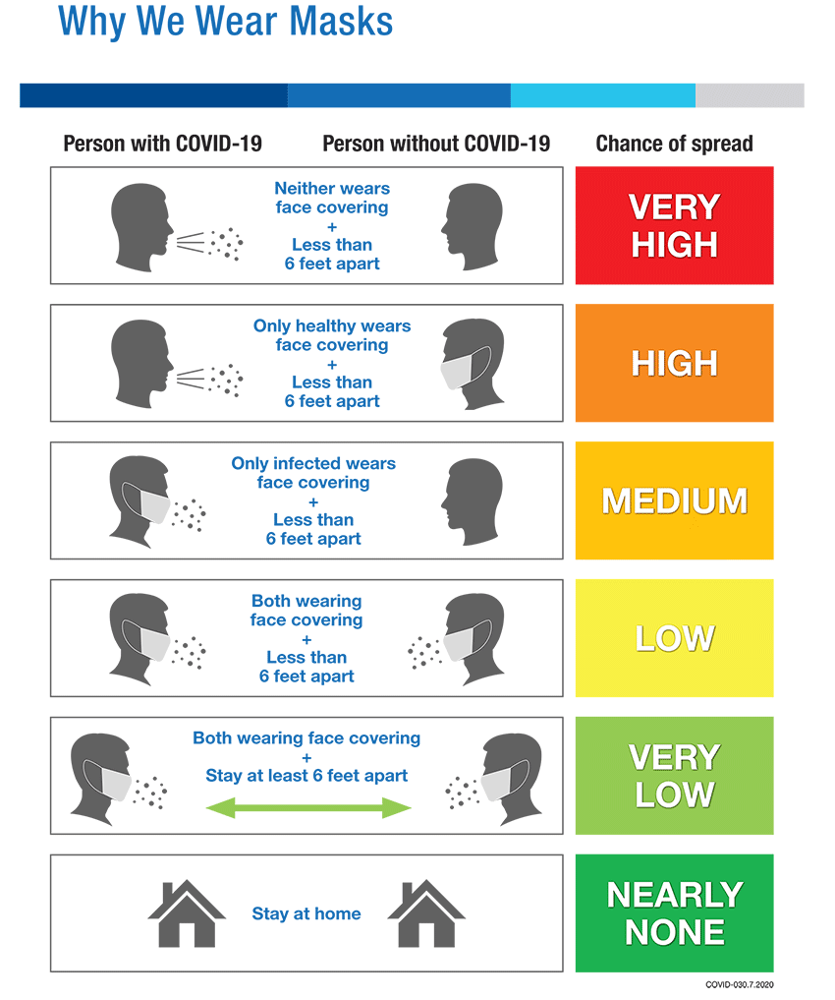
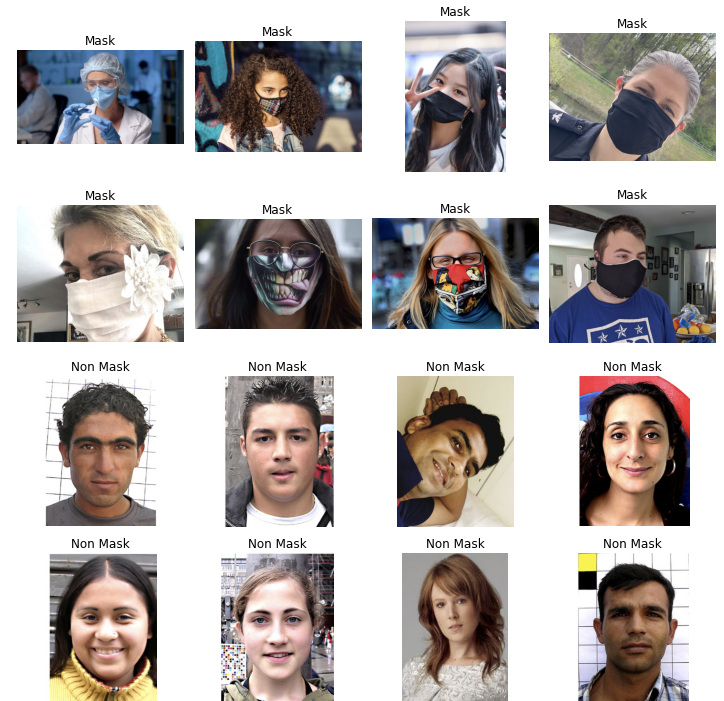
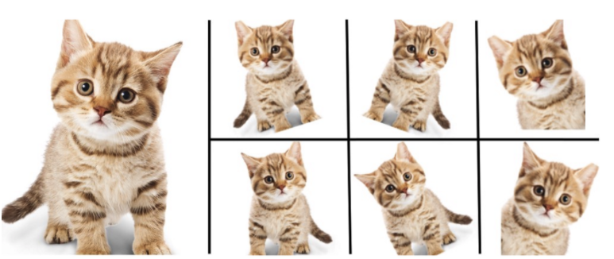
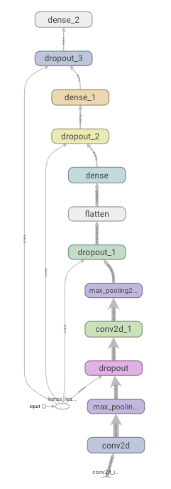
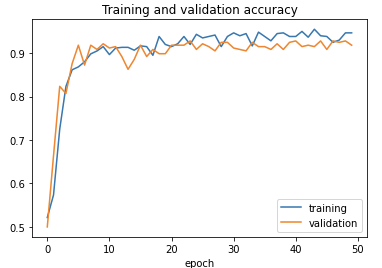
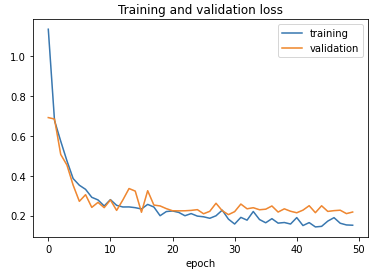
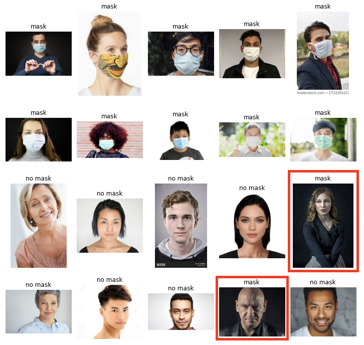

# Face_Mask_Detection
A capstone project for face mask detection using CNN.

# Are you wearing a face mask today? 
## A convolutional neural network solution to determine if a person is wearing a mask or not.

## Introduction 
Masks play a crucial role in protecting the health of individuals against respiratory diseases, as is one of the few precautions available for COVID-19 in the absence of immunization. We are going to construct a CNN model to detect if a person is wearing mask or not. 

## Why we need to wear face masks during COVID-19 pandemic

According to CDC Guidance:

*People age 2 and older should wear masks in public settings and when around people who don’t live in their household.​
*Masks offer some protection to you and are also meant to protect those around you, in case you are unknowingly infected with the virus that causes COVID-19.
*A mask is NOT a substitute for social distancing. Masks should still be worn in addition to staying at least 6 feet apart.

## Goal
Accurately classify whether the person on a given image is wearing a face mask or not.

## Dataset
The dataset contains 1006 images of human faces wearing or not wearing face masks. It has been divided into the training, validation and testing set with two labels: mask and no mask. Each label contains equal number of images for training, validation and testing set.

</a>

## Data Augmentation
Before I start building the model, I used data aggumentation to create new data based on the modifications of our existing training data. It will help to prevent from overtraining, and have a better chance to predict accurately for data that my model hasn't seen yet.

</a>

## Model Framework
I build a Convolutional Neural Network with several hidden layers and dropouts, since CNN is one of the best algorithm for image processing and analyzing.

## Results

* My train set ran with **94% accuracy**
* My validation set ran with **93% accuracy**
* My holdout set ran with **92% accuracy**

                                                                
### Evaluate Performance of the Model

It looks like the model has some difficulity detecting a person not wearing a mask in dark background. Potential solution will be train the model with more no mask pictures with dark background/shadow.
